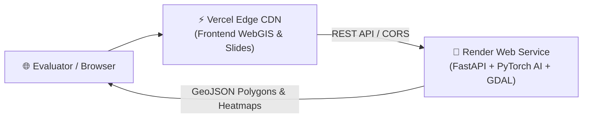

# 🚀 CadastreVision Deployment Guide: Render & Vercel (Step-by-Step)

This guide walks you through deploying the **CadastreVision (SkyGen)** AI & WebGIS platform using the industry-standard split architecture:
- **Backend (Render.com)**: Python 3.10 + GDAL/GEOS + PyTorch AI Inference + FastAPI running in a Docker container.
- **Frontend (Vercel.com)**: Ultra-fast global Edge CDN hosting the Leaflet WebGIS interface, topology inspection tools, and SIH slide deck.

---

## 🏗️ Architecture Overview



---

## 🟢 PART 1: Deploy Backend on Render (AI & GIS Engine)

Render builds and runs our multi-stage [`Dockerfile`](file:///Users/kyashwanth/Documents/sih/Dockerfile) containing Python, GDAL, GEOS, and PyTorch.

### Step 1: Sign In to Render
1. Open [dashboard.render.com](https://dashboard.render.com) in your browser.
2. Sign in using your **GitHub account** (`KYaswanthReddy`).

### Step 2: Create a New Web Service
1. In the top-right corner, click the **"New +"** button.
2. Select **"Web Service"**.

### Step 3: Connect Your GitHub Repository
1. Select **"Build and deploy from a Git repository"** and click **Next**.
2. Find your repository: `KYaswanthReddy/SIH` and click **"Connect"**.
   *(If not visible, click "Configure GitHub App" to grant Render access to the repository).*

### Step 4: Configure the Service
Fill in the following fields:
- **Name**: `cadastrevision-skygen` *(recommended so it matches default config)*
- **Region**: Choose closest to you (e.g., `Singapore`, `Frankfurt`, or `Oregon`)
- **Branch**: `main`
- **Runtime**: **Docker** *(Render auto-detects [`Dockerfile`](file:///Users/kyashwanth/Documents/sih/Dockerfile))*
- **Instance Type**: **Free** ($0/month)

### Step 5: Advanced Settings
Expand **"Advanced"** at the bottom:
- **Health Check Path**: `/api/health`
- **Auto-Deploy**: `Yes` (automatically redeploys whenever you push to GitHub)

### Step 6: Deploy
1. Click **"Create Web Service"**.
2. Render will start pulling the Docker image, installing GDAL/PyTorch dependencies, and launching FastAPI.
3. Building takes **2–4 minutes**. Once complete, the status turns green: **"Live"**.
4. Copy your backend URL at the top of the dashboard:
   ```text
   https://cadastrevision-skygen-r5hn.onrender.com
   ```
5. Test it in your browser: `https://cadastrevision-skygen-r5hn.onrender.com/api/health`
   - You should see: `{"status":"healthy","system":"SIH26012 Cadastral Extraction System",...}`

> [!NOTE]
> **Understanding Render Free Tier Cold Starts**:
> - On Render's Free tier, the web service automatically spins down (sleeps) after 15 minutes of inactivity to save compute.
> - When waking up, the very first request takes **25–40 seconds** to boot up the Docker container. Once awake, all subsequent requests respond in **<200ms**.
> - **Built-in Resilience**:
>   1. **Zero Blank Screen**: The WebGIS frontend loads demo patch imagery and ground-truth boundary lines instantly from edge assets with zero delay!
>   2. **Adaptive Wake-Up Polling**: The frontend displays a live waking indicator (`API: Waking backend (~25s)...`) with an animated pulse and automatic retry loop until the server responds.
>   3. **In-Browser Keep-Alive**: While any user has the tab open, the frontend sends a health ping every 4 minutes, ensuring Render never goes back to sleep during active sessions.
>   4. **24/7 GitHub Actions Keep-Alive**: The repository includes `.github/workflows/keep_alive.yml`, which automatically pings the backend every 12 minutes to keep it warm around the clock!

---

## ⚡ PART 2: Deploy Frontend on Vercel (Fast WebGIS UI)

Vercel serves the interactive map, slide deck, and topology audit deck with zero latency from 100+ global edge locations.

### Step 1: Sign In to Vercel
1. Open [vercel.com](https://vercel.com) in your browser.
2. Sign in with your **GitHub account** (`KYaswanthReddy`).

### Step 2: Import Your Project
1. In the Vercel Dashboard, click **"Add New..."** → **"Project"**.
2. Locate `KYaswanthReddy/SIH` in your repository list and click **"Import"**.

### Step 3: Configure Project Settings
- **Project Name**: `sih-cadastrevision` (or `cadastrevision-skygen`)
- **Framework Preset**: **Other**
- **Root Directory**: `./` *(leave as root; our [`vercel.json`](file:///Users/kyashwanth/Documents/sih/vercel.json) handles routing)*
- **Build and Output Settings**: Leave empty / default.
- **Environment Variables**: None needed!

### Step 4: Click Deploy
1. Click the **"Deploy"** button.
2. Vercel compiles and publishes the edge deployment in **15–30 seconds**.
3. You will get your live public URL:
   ```text
   https://cadastrevision-skygen.vercel.app
   ```

---

## 🔗 PART 3: Connect Frontend to Backend

We have built 3 automatic mechanisms so the frontend and backend talk to each other without configuration errors:

### Method 1: Automatic Connection (Default)
- The frontend defaults directly to `https://cadastrevision-skygen-r5hn.onrender.com` without requiring any manual setup!

### Method 2: Connection Manager Modal (In Top Navbar)
1. Open your live Vercel site: `https://cadastrevision-skygen.vercel.app`
2. In the top navigation bar, click the **"API: ..."** status button.
3. An interactive glassmorphic modal opens:
   - Check real-time server state, ping latency, and device status.
   - Click **"Test / Wake Up"** to actively trigger container spin-up.
   - Click quick preset buttons (Render Default, Vercel Edge Proxy, Localhost).
   - Click **"Save & Connect"**.

### Method 3: Direct URL Parameter (Best for Evaluators)
You can send evaluators a single link that pre-configures the backend:
```text
https://cadastrevision-skygen.vercel.app/?api=https://cadastrevision-skygen-r5hn.onrender.com
```

---

## 📋 Live URLs to Showcase to SIH Judges

Once both are deployed, you have a complete production suite:

| Feature / Page | URL Path | Description |
| :--- | :--- | :--- |
| **Interactive WebGIS Platform** | `https://your-project.vercel.app/` | Live AI boundary prediction, split-screen slider, topology audit |
| **Interactive SIH Slide Deck** | `https://your-project.vercel.app/presentation` | Official 16:9 widescreen presentation slides for team SkyGen |
| **PowerPoint Download** | `https://your-backend.onrender.com/SIH26012_Idea_Presentation.pptx` | Downloadable native PPTX file for offline submission |
| **FastAPI Swagger Docs** | `https://your-backend.onrender.com/docs` | Interactive OpenAPI documentation for all 10 endpoints |
| **System Health API** | `https://your-backend.onrender.com/api/health` | Real-time AI engine and PyTorch device health report |

---

## 🛠️ Alternative: Instant 30-Second Demo via Cloudflare Tunnel

If you want an instant HTTPS link running directly from your laptop during a live demo without waiting for cloud builds:

1. In terminal, start the local server:
   ```bash
   source .venv/bin/activate
   python -m uvicorn backend.main:app --host 0.0.0.0 --port 8000
   ```
2. In a second terminal tab, run:
   ```bash
   npx -y cloudflared tunnel --url http://localhost:8000
   ```
3. Cloudflare gives you an instant temporary public HTTPS URL (e.g. `https://xyz.trycloudflare.com`) that accesses your local system directly.
