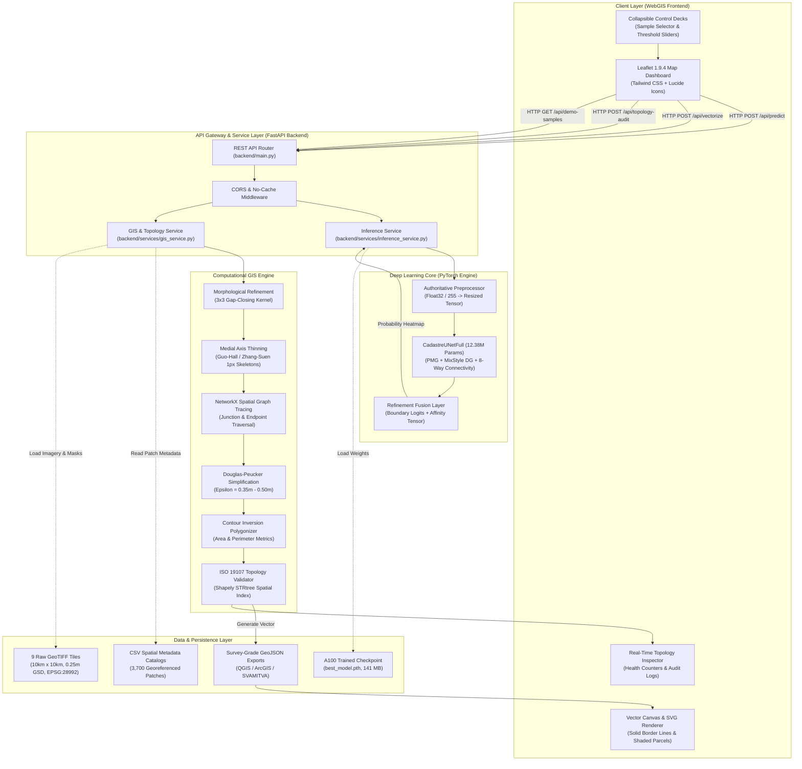
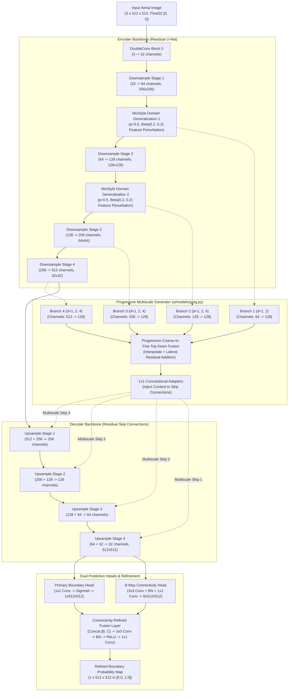
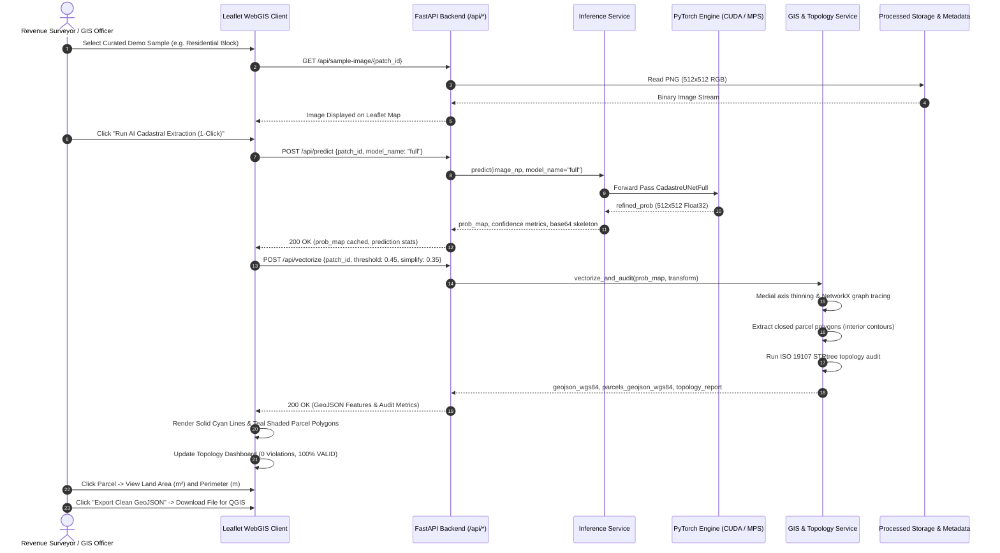
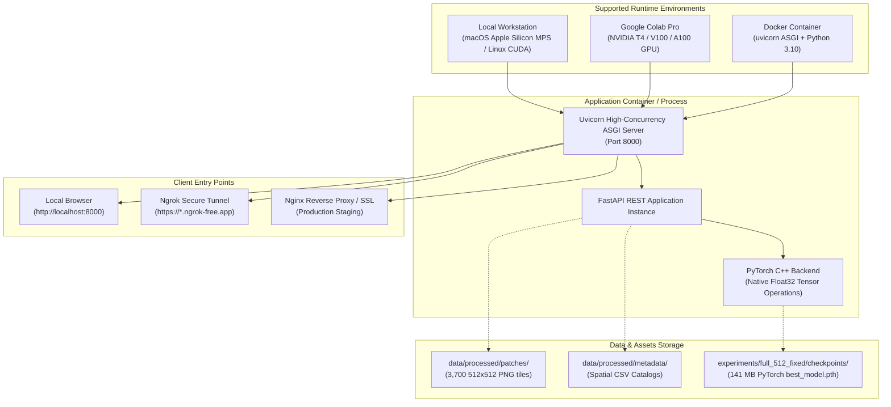

# SIH26012 System Architecture & Technical Flow

> **Smart India Hackathon (SIH26012)**  
> **Problem Title**: Automated Cadastral Feature Extraction & Urban Parcel Mapping System  
> **System Classification**: Deep Learning Geospatial Computer Vision & Computational GIS Platform

---

## 1. System Topology Overview

The SIH26012 platform is architected as an end-to-end decoupled system comprising a high-performance **FastAPI asynchronous backend**, a modern **WebGIS Leaflet client**, a modular **PyTorch deep learning inference core**, and an **algorithmic computational GIS topology engine**.

---

## 2. Detailed Multi-Layer Architecture

### 2.1 Frontend Architecture (`frontend/index.html`)
- **Core Technologies**: Vanilla JavaScript (ES6+), HTML5 Canvas, Tailwind CSS (via CDN), Google Fonts (*Inter* for UI typography, *JetBrains Mono* for coordinates and technical metrics).
- **Map Rendering Engine**: **Leaflet.js 1.9.4** mapping library.
- **Base Layers**:
  - Primary: ESRI World Imagery (High-Resolution Satellite Basemap).
  - Secondary / Fallback: OpenStreetMap Carto Standard.
- **Dynamic Overlays**:
  - **AI Probability Heatmap Overlay**: Live base64-encoded PNG rendered as a `L.imageOverlay` with interactive opacity slider.
  - **Continuous Solid Cadastral Boundaries**: High-contrast rendering featuring a $4.4\text{px}$ dark casing halo (`#000000`, 0.8 opacity) and a $2.5\text{px}$ electric cyan core line (`#00F0FF`, 0.95 opacity).
  - **Closed Cadastral Parcel Polygons**: Semi-transparent teal fills (`#0D9488`, 0.22 opacity) with fine borders (`#2DD4BF`, 1.8px width) outlining interior property plots.
  - **Ground Truth Cadastral Vectors**: High-visibility spring green polylines (`#22C55E`, 2.5px width) toggled on demand to visually benchmark model precision against authentic land registry records.
  - **Supporting Context Layers**: Distinctly styled building footprints (amber `#F59E0B`) and road network centerlines (sky blue `#38BDF8`).
- **Interactive Capabilities**:
  - Feature inspection modal popups displaying Feature ID, metric length ($\text{m}$), model confidence score ($\%$), parcel plot area ($\text{m}^2$), and perimeter ($\text{m}$).
  - Human-in-the-Loop **Feature Approval Action** allowing surveyors to review, approve, and stage individual boundary features.
  - One-click GeoJSON export downloading survey-grade geometries directly for desktop GIS analysis.

---

### 2.2 Backend API Architecture (`backend/main.py`)
- **Framework**: **FastAPI** (Python 3.10+) running under ASGI server **Uvicorn**.
- **Design Pattern**: Service-Oriented Architecture (SOA) separating request routing from business logic services.
- **Key Modules**:
  - `backend/main.py`: Endpoint definition, request deserialization via Pydantic, HTTP exception handling, and static file mounting.
  - `backend/services/inference_service.py`: Hardware device abstraction (CUDA / Apple Silicon MPS / CPU), checkpoint state management, and inference execution.
  - `backend/services/gis_service.py`: Coordinate space conversions, contour polygonization, and topology orchestration.
- **Security & Middleware**:
  - CORS middleware allowing cross-origin integration for distributed deployments.
  - Strict `no-cache` HTTP header middleware preventing browser caching of dynamic prediction heatmaps.

---

### 2.3 Computational GIS & Topology Pipeline (`gis/`)

```mermaid
flowchart TD
    RAW_PROB["Model Probability Map [0.0, 1.0]\n(512x512 Float32 Array)"]
    
    subgraph Refinement["Stage 1: Morphological Cleanup"]
        BIN["Dynamic Thresholding\n(Default: 0.45 - 0.50)"]
        CLOSE["Morphological Closing\n(3x3 Structuring Element)"]
        FILTER["Component Area Filter\n(Prune Blobs < 40px)"]
    end

    subgraph Centerline["Stage 2: Medial Axis Skeletonization"]
        THIN["Zhang-Suen / Guo-Hall Thinning\n(Sub-pixel 1px Medial Axis)"]
        NODES["Node Classification\n(Endpoints: Deg 1 | Junctions: Deg >= 3)"]
    end

    subgraph Vectorization["Stage 3: Spatial Graph Vectorization"]
        GRAPH_BUILD["NetworkX Undirected Graph\n(8-Connected Adjacency)"]
        TRACE["Contiguous Branch Tracing\n(Cycle & Segment Traversal)"]
        SIMP["Douglas-Peucker Simplification\n(Epsilon = 0.35m Tolerance)"]
        AFFINE["Affine Coordinate Projection\n(Pixel (c, r) -> EPSG:28992 Metric XY)"]
        SNAP["Endpoint Snapping\n(Bridge Micro-Gaps <= 1.8m)"]
        MERGE["Contiguous Polyline Merge\n(linemerge to Solid Continuous Lines)"]
    end

    subgraph ParcelExtraction["Stage 4: Closed Parcel Polygonization"]
        INV["Boundary Mask Inversion\n(Interior Property Plots)"]
        CONTOUR["OpenCV Topological Contour Tracing\n(RETR_CCOMP / CHAIN_APPROX_TC89_L1)"]
        METRIC_CALC["Metric Calculation\n(Area m²: px * 0.0625 | Perimeter m: px * 0.25)"]
        AREA_FILTER["Area Filter\n(20 m² <= Land Area <= 25,000 m²)"]
        POLY_GDF["Parcel GeoDataFrame\n(EPSG:28992 -> EPSG:4326 Reprojection)"]
    end

    subgraph TopologyAudit["Stage 5: ISO 19107 Topology Audit"]
        STRTREE["Shapely STRtree Spatial Index\n(Pairwise Bounding-Box Pruning)"]
        VALID_CHECK["OGC Validity & Self-Intersection Audit\n(geom.is_valid & geom.is_simple)"]
        DUP_CHECK["Duplicate Line Detection\n(Normalized Vertex Sequences)"]
        DANGLING["Dangling Segment Analysis\n(Endpoint Proximity < 0.5m)"]
        REPORT["Generate JSON Audit Report\n(Status: VALID | 0 Errors)"]
    end

    RAW_PROB --> BIN
    BIN --> CLOSE
    CLOSE --> FILTER
    FILTER --> THIN
    THIN --> NODES
    NODES --> GRAPH_BUILD
    GRAPH_BUILD --> TRACE
    TRACE --> SIMP
    SIMP --> AFFINE
    AFFINE --> SNAP
    SNAP --> MERGE

    CLOSE --> INV
    INV --> CONTOUR
    CONTOUR --> METRIC_CALC
    METRIC_CALC --> AREA_FILTER
    AREA_FILTER --> POLY_GDF

    MERGE --> STRTREE
    STRTREE --> VALID_CHECK
    VALID_CHECK --> DUP_CHECK
    DUP_CHECK --> DANGLING
    DANGLING --> REPORT
```

---

### 2.4 Deep Learning Architecture (`ai/models/full_model.py`)

The neural network is a specialized geospatial architecture designated **`CadastreUNetFull`**:

---

## 3. Data Flow & Request-Response Sequence

---

## 4. Deployment Architecture

The system supports both local workstation execution and containerized cloud/server deployment.

---

## 5. Architectural Distinction: Cadastral Boundaries vs Supporting Context Layers

> [!IMPORTANT]
> **Fundamental Cadastral Governance Principle**:
> A cadastral boundary delineates **legal land ownership and property rights**. It is invisible in many real-world scenarios (e.g., unmarked inheritance partitions, open agricultural field boundaries, rights-of-way).
> 
> Many hackathon projects conflate building footprints with cadastral parcel boundaries. In SIH26012:
> 1. **Cadastral Parcel Boundaries**: The primary output of our neural network and GIS pipeline, representing property demarcations registered with the national land authority.
> 2. **Building Footprints & Road Networks**: Treated strictly as **Supporting Context Layers** served via `/api/supporting-layers/{type}/{patch_id}`. They provide situational context to revenue surveyors without corrupting legal property deeds.
