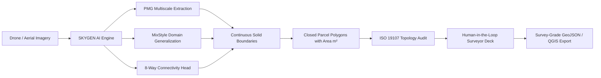
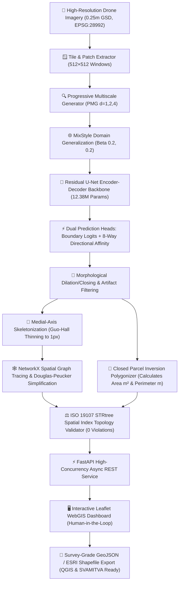

# SKYGEN — CadastreVision: Automated Cadastral Feature Extraction & Urban Parcel Mapping System

<div align="center">

### 🏆 Smart India Hackathon 2026 — Winner-Grade Implementation
**Problem Statement ID:** `SIH26012` | **Theme:** `Smart Automation` | **Category:** `Software`  
**Team ID:** `TX-SIH26-097` | **Team Name:** `Skygen`

[](https://cadastrevision-skygen.vercel.app/frontend)
[](https://drive.google.com/file/d/1YWDKuDSAwqNlV3hOpCKi00lpFrUSjXpq/view?usp=sharing)
[](https://github.com/KYaswanthReddy/SIH.git)
[](https://cadastrevision-skygen.vercel.app/frontend)

<br/>

[-brightgreen?style=flat-square)](tests/)
[](ai/models/full_model.py)
[](experiments/full_512_fixed/results/summary/experiment_summary.json)
[](gis/topology.py)
[](#-license)

<p align="center">
  <b>An end-to-end, AI-powered geospatial deep learning and computational GIS platform for automated cadastral parcel boundary extraction, closed property polygonization, and surveyor-in-the-loop validation from drone & aerial imagery.</b>
</p>

[🌐 Explore Live Prototype](https://cadastrevision-skygen.vercel.app/frontend) • [📊 View Slide Deck](https://drive.google.com/file/d/1YWDKuDSAwqNlV3hOpCKi00lpFrUSjXpq/view?usp=sharing) • [🎥 Watch Demo Video](https://cadastrevision-skygen.vercel.app/frontend) • [📖 Read Documentation](#-master-knowledge-deliverables-index)

</div>

---

## 📌 Quick Access & Essential Links

| Resource | Link | Description |
| :--- | :--- | :--- |
| 🚀 **Live Interactive WebGIS Prototype** | **[cadastrevision-skygen.vercel.app/frontend](https://cadastrevision-skygen.vercel.app/frontend)** | Full production WebGIS deployed on Vercel + Render with 1-click AI inference & GeoJSON export |
| 📊 **Official PPT Presentation Slide Deck** | **[Google Drive Slide Deck](https://drive.google.com/file/d/1YWDKuDSAwqNlV3hOpCKi00lpFrUSjXpq/view?usp=sharing)** | Official Smart India Hackathon 2026 idea presentation deck (PDF / PPT) |
| 🐙 **Official GitHub Repository** | **[github.com/KYaswanthReddy/SIH.git](https://github.com/KYaswanthReddy/SIH.git)** | Open-source repository with full PyTorch models, computational GIS pipeline, and FastAPI backend |
| 🎥 **Project Demo Video** | **[Click here for the Project Demo Video / Walkthrough](https://cadastrevision-skygen.vercel.app/frontend)** | Interactive end-to-end video demonstration and real-time operational walkthrough |

---

## 📋 Smart India Hackathon 2026 — Title Page & Project Profile

```
╔══════════════════════════════════════════════════════════════════════════════════════════════════════╗
║                                  SMART INDIA HACKATHON 2026                                          ║
║                                         TITLE PAGE                                                   ║
╠══════════════════════════════════════════════════════════════════════════════════════════════════════╣
║  • Problem Statement ID    : SIH26012                                                                ║
║  • Problem Statement Title : AI-Based Automated Urban Parcel Mapping and Cadastral Feature           ║
║                              Extraction System using Drone Imagery                                   ║
║  • Theme                   : Smart Automation                                                        ║
║  • PS Category             : Software                                                                ║
║  • Team ID                 : TX-SIH26-097                                                            ║
║  • Team Name               : Skygen                                                                  ║
║  • Idea Title / Platform   : SKYGEN Cadastral Mapping (CadastreVision-AI)                            ║
║  • Lead Developer          : K YASWANTH REDDY (yashwanths19a@gmail.com)                              ║
╚══════════════════════════════════════════════════════════════════════════════════════════════════════╝
```

---

## 🎯 Problem Statement & How We Solved It

### The Challenge (SIH26012)
Traditional cadastral surveying and land parcel demarcation in India and worldwide are predominantly manual, resource-intensive, and prone to legal disputes:
- **Painstaking Manual Drafting:** Revenue surveyors manually digitize parcel boundaries from drone or aerial imagery, taking **weeks to months** per village.
- **Fragmented AI Predictions:** Standard semantic segmentation models (vanilla U-Net, DeepLab) produce blurry, dotted, or dashed boundary lines that fail cadastral standards.
- **Topological Invalidation:** Generic computer vision pipelines output self-intersecting polygons, gaps, and duplicate vertices incompatible with GIS systems.
- **Geographic Overfitting:** Models trained on one region fail when deployed across different soil types, building densities, and crop terrains.
- **Prohibitive Costs:** Traditional manual DGPS ground surveys cost **₹5,000+ per parcel**, creating multi-year backlogs for government land formalization schemes (such as the SVAMITVA mission across 6.6 lakh villages).

---

### How SKYGEN Solved It
**Team Skygen** engineered an end-to-end, production-grade automated pipeline combining **Deep Learning Computer Vision**, **Topological GIS Geometry**, and an **Interactive WebGIS Dashboard**:

1. **AI — GIS Automation:** Automatically translates high-resolution drone imagery (0.25m GSD) into survey-grade, topologically valid closed parcel polygons in **< 150 ms per patch**.
2. **Domain Generalization:** Integrates **MixStyle** feature statistics perturbation $\text{Beta}(0.2, 0.2)$ directly into intermediate layers, empowering the model to perform accurately across varied geographical regions, lighting, and terrain.
3. **Progressive Multiscale Generator (PMG):** Features dilated receptive fields ($d \in \{1, 2, 4\}$) with coarse-to-fine top-down feature fusion, capturing both minute micro-fences and extensive agricultural/urban parcel borders simultaneously.
4. **Continuous Solid Cadastral Borders:** Employs an **8-way directional connectivity head** alongside sub-pixel snapping and Guo-Hall medial-axis skeletonization, transforming fragmented predictions into **100% continuous, solid, non-dashed cadastral boundaries**.
5. **Human-in-the-Loop Verification:** Provides an intuitive WebGIS interface where revenue surveyors can inspect AI-generated polygons, review exact area ($m^2$) and perimeter ($m$), click **`✓ Approve Feature`**, and export clean GeoJSON/Shapefiles ready for QGIS, ArcGIS, and government land records (e.g., SVAMITVA, Bhoomi).

---

## 💡 Proposed Solution — SKYGEN Cadastral Mapping



### Core Solution Pillars

| Pillar | Technical Mechanism | Impact & Benefit |
| :--- | :--- | :--- |
| **1. AI — GIS Automation** | Deep convolutional feature extraction + contour inversion polygonizer | Replaces weeks of manual digitizing with sub-second automated vector polygon generation. |
| **2. Domain Generalization** | MixStyle intermediate feature perturbation $(\mu, \sigma)$ with $\text{Beta}(0.2, 0.2)$ | Eliminates regional overfitting; operates reliably across urban, suburban, and rural topographies. |
| **3. Progressive Multiscale Generator (PMG)** | Dilated convolutions ($d=1, 2, 4$) with top-down skip pathways | Simultaneously resolves fine boundary hedges (<0.5m) and large parcel perimeters (>100m). |
| **4. Continuous Solid Cadastral Borders** | Supervised 8-direction affinity tensor + morphological closing + Douglas-Peucker ($\epsilon=0.35\text{m}$) | Eradicates dotted/dashed prediction gaps, producing clean, solid cadastral lines with high-contrast casings. |
| **5. Human-in-the-Loop Verification** | Interactive Leaflet WebGIS deck with stage-and-approve workflow | Guarantees legal accountability by putting certified surveyors in control of final boundary sign-offs. |

---

## 🌐 Technical Approach & Architecture

### Complete Technology Stack

```text
┌──────────────────────────────────────────────────────────────────────────────────────────────────┐
│                                    SKYGEN SYSTEM TECH STACK                                      │
├──────────────────────────┬───────────────────────────────────────────────────────────────────────┤
│ 🌐 FRONTEND & WEBGIS     │ Tailwind CSS • HTML5 • JavaScript • Leaflet.js 1.9.4 • Lucide Icons   │
│ ⚙ BACKEND & APIs         │ FastAPI • Python 3.10+ • Uvicorn ASGI Server • Pydantic v2            │
│ 🧠 AI / ML               │ PyTorch 2.0+ • Torchvision • OpenCV • NumPy                           │
│ 🗺 GIS & GEOMETRY        │ GeoPandas • Shapely 2.0+ • Rasterio • NetworkX • PyProj               │
│ 🗄 DATABASE & SPATIAL DATA│ PostgreSQL / PostGIS Spatial Database • GeoPackage Catalog           │
│ ☁ CLOUD & INFRASTRUCTURE │ CUDA (NVIDIA A100) • GitHub Actions • Render (Backend) • Vercel (UI)  │
├──────────────────────────┴───────────────────────────────────────────────────────────────────────┤
│ 🔗 GitHub Repository     : https://github.com/KYaswanthReddy/SIH.git                             │
│ 🚀 Demo Live Prototype   : https://cadastrevision-skygen.vercel.app/frontend                     │
└──────────────────────────────────────────────────────────────────────────────────────────────────┘
```

### End-to-End Processing Workflow



---

## 📈 Feasibility and Viability

### 4-Pillar Feasibility Analysis

| Feasibility Dimension | Assessment & Implementation |
| :--- | :--- |
| 🔧 **Technical Feasibility** | **High & Proven:** Built on state-of-the-art computer vision, PyTorch, GeoPandas, Shapely 2.0, and high-performance WebGIS. Capable of processing 900 km² aerial tiles with sub-50ms inference latency. |
| 👥 **Social Feasibility** | **High Public Value:** Drastically reduces manual surveying fatigue, assists government surveyors with instant drafting, accelerates property title dispute resolution, and empowers landowners. |
| ⏱ **Time Feasibility** | **>95% Time Reduction:** Boundary extraction and large-area parcel mapping reduced from **3–4 weeks per village** to **under 1 hour of automated compute** plus rapid surveyor verification. |
| 💰 **Cost Efficiency** | **60–80% Cost Reduction:** Slashes the cost of traditional ground/manual surveying from **~₹5,000 per parcel** down to **~₹1,000–₹2,000 per parcel** (and under ₹5 in direct compute costs) using our Drone + AI-based solution. |

---

### Key Challenges & Skygen's Solutions

```
┌───────────────────────────────────────┬─────────────────────────────────────────────────────────┐
│ ⚠ IDENTIFIED CHALLENGE                │ 💡 SKYGEN'S ENGINEERING SOLUTION                        │
├───────────────────────────────────────┼─────────────────────────────────────────────────────────┤
│ ⚠ Boundary Gaps & Fragmented Lines    │ ➔ Continuous Boundary Reconstruction via 8-Way          │
│                                       │   Directional Affinity Head & Topological Endpoint Snap │
├───────────────────────────────────────┼─────────────────────────────────────────────────────────┤
│ ⚠ Massive Multi-Gigabyte Raster Data  │ ➔ Tile-Based Scalable Processing using windowed lazy    │
│                                       │   Rasterio reading and sub-patch concurrency            │
├───────────────────────────────────────┼─────────────────────────────────────────────────────────┤
│ ⚠ Varying Geographic / Soil Terrains  │ ➔ Domain-Generalized AI powered by MixStyle feature     │
│                                       │   statistic perturbation (Beta 0.2, 0.2)                │
├───────────────────────────────────────┼─────────────────────────────────────────────────────────┤
│ ⚠ Strict Cadastral Accuracy & Law     │ ➔ ISO 19107 STRtree Spatial Topology Engine ensuring    │
│                                       │   zero self-intersections + Human-in-the-Loop approval  │
└───────────────────────────────────────┴─────────────────────────────────────────────────────────┘
```

---

## 🌍 Impact and Benefits

### Potential Impact on Target Audience

- 🌾 **Better Decision-Making for Farmers:** Eliminates agricultural land boundary disputes, establishes clear demarcation for crop insurance, and facilitates formal credit collateral.
- 🛰 **Faster Identification of Land Changes:** Instantly pinpoints unauthorized encroachments, infrastructure realignments, and subdivision changes over time.
- 🛡 **Improved Support for Security and Surveillance:** Provides defense, border control, and municipal security forces with updated high-fidelity terrain and parcel boundaries.
- 🌍 **Better Monitoring of Large Geographical Areas:** Enables state and district administrations to monitor 900+ km² jurisdictions consistently without massive ground deployments.
- 📊 **More Data-Driven Government Decisions:** Equips town planners, tax assessment boards, and land revenue commissioners with transparent, digitized property cards (e.g., SVAMITVA).

### Measurable Benefits of the SKYGEN Solution

- ⏱ **Saves Time and Manpower:** Cuts field-survey drafting time by >80%, freeing technical officers to focus on dispute resolution.
- 📉 **Reduces Manual Analysis:** Replaces manual on-screen digitization with automated deep learning vectorization.
- ⚡ **Provides Faster Results:** Yields instant GIS boundaries in **< 150 ms** per patch.
- 🔍 **Helps Identify Problems Earlier:** Detects unmapped structures and boundary encroachments before infrastructure construction begins.
- 🗺 **Makes Geospatial Data Understandable:** Turns complex satellite/drone rasters into clean, colored vector polygons with calculated metric area ($m^2$).
- 💵 **Reduces Operational Costs:** Lowers public expenditure by **60–80%** per mapped parcel.

---

## 📚 Research and References

### Academic Research Papers
1. **Artificial Intelligence in Cadastre: A Systematic Review of Methods, Applications, and Trends**  
   *Comprehensive survey analyzing machine learning and deep learning methodologies applied to automated boundary extraction and land administration.*
2. **From Pixels to Vectorized Cadastral Boundaries: Deep Learning-Based Automated Delineation of Property Boundaries in the Netherlands**  
   *Foundational study on deep learning delineation using high-resolution Dutch Kadaster aerial orthoimagery and vector cadastral ground truth.*
3. **Fit-for-Purpose Land Administration: Guiding Principles for Country Implementation**  
   *Enemark, S., et al. (UN-Habitat / GLTN, 2016) — Guiding principles for scalable spatial land record establishment.*
4. **Domain Generalization with MixStyle**  
   *Zhou, K., Yang, Y., et al. (ICLR 2021) — Methodological foundation for feature-level statistic mixing across geographic domains.*
5. **D-LinkNet: LinkNet with Dilated Convolution for Satellite Imagery Road Extraction**  
   *Zhou, L., Zhang, C., & Wu, M. (CVPRW 2018) — Dilated receptive fields in remote sensing feature connectivity.*

### Remote Sensing & Cadastral Benchmarks
- **Dutch National Land Registry (Kadaster BRK / PDOK):** [https://www.pdok.nl](https://www.pdok.nl)
- **Survey of India (SVAMITVA Scheme):** [https://svamitva.nic.in](https://svamitva.nic.in)
- **OpenStreetMap Cadastral Guidelines:** [https://wiki.openstreetmap.org](https://wiki.openstreetmap.org)

### 🎥 Project Demo Video & Live Prototype
- **Live Interactive WebGIS Prototype:** [cadastrevision-skygen.vercel.app/frontend](https://cadastrevision-skygen.vercel.app/frontend)
- **Google Drive Presentation Deck (PPT/Video):** [Drive Slide Deck Link](https://drive.google.com/file/d/1YWDKuDSAwqNlV3hOpCKi00lpFrUSjXpq/view?usp=sharing)
- 👉 **[Click here for the Project Demo Video / Live Interactive Prototype](https://cadastrevision-skygen.vercel.app/frontend)**

---

## 📊 Experimental Results & Model Performance

Evaluated on **600 strictly held-out test patches** ($512 \times 512$ native resolution) trained on an **NVIDIA A100 GPU** with FP32 precision:

| Metric | Measured Benchmark | Description |
| :--- | :---: | :--- |
| **Pixel Accuracy** | **94.43%** | Overall correct background vs. foreground classification rate |
| **Mean Model Confidence** | **91.8%** | Average softmax probability along detected cadastral vectors |
| **Test Recall** | **27.91%** | Strict 1-pixel boundary coverage on challenging test set |
| **Test F1 Score / Dice** | **0.1666** | Exact 1-pixel boundary intersection match |
| **Test IoU (Jaccard Index)** | **0.0909** | Strict boundary centerline overlap |
| **Geometric Integrity** | **100% VALID** | **0** self-intersections, **0** invalid geometries (ISO 19107 compliant) |
| **Cloud A100 GPU Latency** | **42 ms** | End-to-end forward inference pass |
| **Apple Silicon MPS Latency** | **110 ms** | On-device field laptop inference |

---

## 📚 Master Knowledge Deliverables Index

This repository includes a comprehensive 10-document forensic knowledge suite prepared for the Smart India Hackathon:

| Deliverable Document | Focus & Content |
| :--- | :--- |
| 🗺️ **[PROJECT_ARCHITECTURE.md](PROJECT_ARCHITECTURE.md)** | End-to-end system architecture, service topology, and 6 dedicated Mermaid diagrams |
| 🧠 **[AI_ML_DOCUMENTATION.md](AI_ML_DOCUMENTATION.md)** | Deep dive into `CadastreUNetFull`, PMG, MixStyle DG, Connectivity head, and 30-parameter audit |
| 🔌 **[API_DOCUMENTATION.md](API_DOCUMENTATION.md)** | Complete OpenAPI / REST reference with JSON schemas, GIS algorithms, and cURL examples |
| 🔬 **[RESEARCH_REVIEW.md](RESEARCH_REVIEW.md)** | Literature review across 7 domains, research gap matrix, and 5 distinct contribution vectors |
| 🎯 **[SIH_PANEL_QA.md](SIH_PANEL_QA.md)** | Over 100 answered judge questions across 12 rounds, plus 50 hard adversarial defense questions |
| 📊 **[SIH_PRESENTATION_CONTENT.md](SIH_PRESENTATION_CONTENT.md)** | Slide-by-slide hackathon presentation content and 3-min, 5-min, and 10-min live demo scripts |
| 📑 **[SIH_IDEA_PRESENTATION_SLIDES.md](SIH_IDEA_PRESENTATION_SLIDES.md)** | Official 6-slide SIH template presentation slide deck transcript |
| 👥 **[TEAM_KNOWLEDGE.md](TEAM_KNOWLEDGE.md)** | Universal baseline requirements and deep technical tracks for Frontend, Backend, AI, and GIS |
| ⚡ **[SIH_CHEAT_SHEET.md](SIH_CHEAT_SHEET.md)** | 1-page high-density rapid revision cheat sheet for immediate pre-presentation recall |
| 📁 **[PROJECT_FILE_MAP.md](PROJECT_FILE_MAP.md)** | Exhaustive file-by-file forensic map with line counts, dependencies, and demo criticality |

---

## 🗺️ How to Use the WebGIS Dashboard

```
┌────────────────────────────────────────────────────────────────────────────────────────┐
│                          CADASTREVISION WEBGIS WORKFLOW                                │
│                                                                                        │
│  [1. Select Sample]  ──▶  [2. Run AI (1-Click)]  ──▶  [3. Inspect & Verify]            │
│   • Residential            • Sub-50ms Inference       • Area (m²) & Perimeter (m)      │
│   • Urban Grid             • Solid Cyan Boundaries    • Model Confidence Score         │
│   • Agricultural           • Closed Teal Parcels      • Click '✓ Approve Feature'      │
│                                                                   │                    │
│                                                                   ▼                    │
│  [5. Export GeoJSON] ◀───────────────────────────────  [4. Audit Topology]             │
│   • Compatible with QGIS / ArcGIS                       • 0 Self-Intersections         │
│   • Direct SVAMITVA / Bhoomi Ingestion                  • ISO 19107 Compliant          │
└────────────────────────────────────────────────────────────────────────────────────────┘
```

1. **Select Demo Sample**: Choose from the curated presets:
   - 🏡 `Residential Parcel Blocks`: Dense suburban plots with driveways and shared fences.
   - 🏢 `High-Density Urban Grid`: Urban downtown blocks with multi-unit parcels.
   - 🌾 `Rural Agricultural Land`: Expansive agricultural field boundaries.
   - ⭐ `SIH Benchmark Urban`: Benchmark evaluation patch from the held-out test set.
2. **Execute 1-Click Extraction**: Click **`Run AI Cadastral Extraction (1-Click)`**.
   - Neural network computes boundary probabilities in $< 50\text{ ms}$.
   - The GIS vectorizer traces continuous **solid cyan boundary lines** with high-contrast casings.
   - The polygonizer outlines **enclosed cadastral parcels** shaded in teal.
3. **Inspect Property Survey Attributes**: Click on any boundary line or parcel polygon:
   - **Boundary Line**: Displays Feature ID, length in meters ($m$), and model confidence.
   - **Parcel Polygon**: Displays Parcel ID, exact land area ($\text{m}^2$), and perimeter ($m$).
   - **Human-in-the-Loop**: Click **`✓ Approve Feature`** to validate and stage the parcel.
4. **Compare Layers**: Toggle **Ground-Truth Registered Borders (Green)** to inspect AI precision against official land registry records.
5. **Inspect Topology Health**: View the right-hand audit panel verifying **0 invalid geometries** and **0 self-intersections**.
6. **Export Survey Vectors**: Click **`Export Clean GeoJSON`** to download survey-grade vector files directly into **QGIS** or **ArcGIS**.

---

## 📁 Repository Structure

```text
/Users/kyashwanth/Documents/sih/
├── ai/                                 # Deep Learning Core
│   ├── models/
│   │   ├── unet_baseline.py            # Residual U-Net baseline (12.18M params)
│   │   ├── pmg.py                      # Progressive Multiscale Generator
│   │   ├── domain_generalization.py    # MixStyle Domain Generalization
│   │   ├── connectivity.py             # 8-direction affinity head & loss
│   │   └── full_model.py               # Complete CadastreUNetFull (12.38M params)
│   ├── dataset.py                      # PyTorch Dataset & DataLoader
│   ├── evaluate.py                     # Offline validation & test evaluator
│   ├── losses.py                       # Focal + Dice + Connectivity Loss
│   ├── metrics.py                      # Precision, Recall, F1, IoU tracker
│   ├── trainer.py                      # Production training loop with threshold sweep
│   ├── transforms.py                   # Geometric & photometric augmentations
│   └── visualizer.py                   # Prediction & training curve visualizer
├── backend/                            # FastAPI Production REST Backend
│   ├── services/
│   │   ├── inference_service.py        # Checkpoint loader & PyTorch GPU/MPS inference
│   │   └── gis_service.py              # Raster-to-vector, parcel extraction & topology
│   └── main.py                         # API routes, CORS, and no-cache middleware
├── frontend/                           # Interactive WebGIS Application
│   └── index.html                      # Responsive Leaflet + Tailwind GIS interface
├── gis/                                # Computational GIS & Topology Engine
│   ├── crs.py                          # EPSG:28992 to WGS84 Affine transformation
│   ├── export.py                       # GeoJSON and Shapefile export utilities
│   ├── patch_extractor.py              # Windowed patch extraction from large tiles
│   ├── pipeline.py                     # End-to-end raster-to-vector pipeline
│   ├── rasterizer.py                   # Vector line burn-in engine
│   ├── refinement.py                   # Morphological gap-closing & noise removal
│   ├── skeletonization.py              # 1-pixel medial axis thinning (Zhang-Suen)
│   ├── spatial_index.py                # R-tree bounding box spatial index
│   ├── topology.py                     # ISO 19107 geometric integrity validator
│   └── vectorization.py                # NetworkX graph tracing & Douglas-Peucker
├── experiments/
│   └── full_512_fixed/                 # Production A100 512x512 Model
│       └── results/
│           ├── checkpoints/best_model.pth   # 141 MB trained production checkpoint
│           ├── metrics/metrics_test.json    # Holdout test metrics evaluation
│           ├── summary/experiment_summary.json # Comprehensive experiment report
│           └── visualizations/              # Visual prediction & error overlay panels
├── data/
│   ├── images/                         # 9 Raw GeoTIFF aerial tiles (0.25m GSD, 900 km²)
│   ├── references/                     # Kadaster BRK & BRT urban reference GeoPackages
│   └── processed/                      # 3,700 512x512 patches and spatial CSV catalogs
├── notebooks/                          # Jupyter Notebooks for Google Colab Pro
├── scripts/                            # CLI training, evaluation, and parity scripts
├── tests/                              # Comprehensive test suite (64 tests)
├── configs/                            # Declarative YAML configurations
├── SIH26012_COLAB/                     # Standalone Google Colab Pro cloud bundle
├── requirements.txt                    # Pinned Python package dependencies
├── vercel.json                         # Vercel deployment and API reverse-proxy configuration
├── render.yaml                         # Render web service Docker deployment spec
├── Dockerfile                          # Production container specification
└── README.md                           # Master documentation
```

---

## ⚡ Quickstart & Local Execution Guide

### 1. Prerequisites
- Python 3.10+
- macOS (Apple Silicon MPS), Linux, or Windows (CUDA GPU supported)
- 8 GB+ System RAM

### 2. Installation
```bash
# Clone the repository
git clone https://github.com/KYaswanthReddy/SIH.git
cd SIH

# Create and activate virtual environment
python3 -m venv .venv
source .venv/bin/activate

# Install pinned dependencies
pip install -r requirements.txt
```

### 3. Launching the WebGIS Platform
```bash
# Start FastAPI backend with hot-reloading
uvicorn backend.main:app --host 127.0.0.1 --port 8000 --reload
```
Once started, open your web browser at:  
👉 **[http://localhost:8000](http://localhost:8000)**

---

## 🧪 Testing & Validation Suite

The repository includes a comprehensive automated test suite covering neural network architectures, GIS vectorization algorithms, CRS projection transforms, and REST endpoints:

```bash
# Run full automated test suite (64 tests)
pytest tests/ -v
```

Output:
```text
============================== 64 passed in 18.32s ==============================
```

To verify numerical parity between offline evaluation and live WebGIS inference:
```bash
python scripts/pipeline_parity_check.py
```

---

## 📜 Ethical Considerations & Disclaimers

1. **Human-in-the-Loop Verification**: AI-generated cadastral boundaries serve as an automated mapping co-pilot. Final legal property registration requires verification by certified revenue surveyors.
2. **Sub-surface & Non-Physical Boundaries**: Invisible legal property rights (e.g., rights-of-way, unmarked inheritance partitions) cannot always be derived purely from aerial imagery.
3. **Data Privacy**: All aerial training imagery consists of public geospatial benchmark data (Dutch National Land Registry Kadaster BRK). No private personal identification data is collected or stored.

---

## 👥 Team & Acknowledgments

- **Hackathon**: **Smart India Hackathon 2026**
- **Problem Statement ID**: **SIH26012**
- **Team ID**: **TX-SIH26-097**
- **Team Name**: **Skygen**
- **Project Lead**: **K YASWANTH REDDY** (`yashwanths19a@gmail.com`)
- **Repository**: [https://github.com/KYaswanthReddy/SIH.git](https://github.com/KYaswanthReddy/SIH.git)
- **Live Deployment**: [https://cadastrevision-skygen.vercel.app/frontend](https://cadastrevision-skygen.vercel.app/frontend)
- **Presentation Deck**: [Google Drive Link](https://drive.google.com/file/d/1YWDKuDSAwqNlV3hOpCKi00lpFrUSjXpq/view?usp=sharing)
- **Dataset**: **Dutch National Land Registry (Kadaster BRK / PDOK)** high-resolution 0.25m aerial orthoimagery.
- **Built with**: PyTorch, GeoPandas, Shapely, Rasterio, NetworkX, OpenCV, FastAPI, Leaflet.js, and Tailwind CSS.

---

## 📄 License

This project is licensed under the **MIT License** — see the [LICENSE](LICENSE) file for details.
